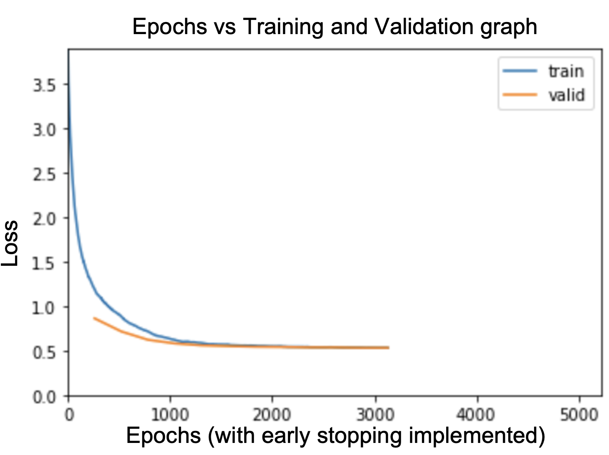

# PlantifyDr 🌿

A mobile application utilizing 2D Convolutional Neural Networks (CNNs) to diagnose crop diseases through image classification of plant leaves.


## Table of Contents

- [Machine Learning Notebooks](notebooks)
  - [Plant models](notebooks/plants)
  - [Experiments with transfer learning](notebooks/experiments)
  - [Model visualization](images/Resnet50.onnx.png)
- [iOS App Code](PlantifyDr_iOS)
- [Deployment Code](plantifydr)

## Built With

- [fastai](https://docs.fast.ai/) - A deep learning library written in Python based off of PyTorch
- [Flask](https://flask.palletsprojects.com/en/1.1.x/) - Used as web framework for deployment
- [Docker Compose](https://docs.docker.com/compose/) - Used to run application
- [WSGI](https://wsgi.readthedocs.io/en/latest/what.html) - Web Server Gateway Interface to communicate with web application
- [AWS](https://aws.amazon.com/) - For hosting ML models
- [Swift](https://developer.apple.com/swift/) - For creating iOS app
- [Postman](https://www.postman.com/) - For testing API

  
  <p></p>
  
  
  
  
  

## Project Plan


## Model architecture

- The power of convolutional neural networks (CNNs), specifically, `ResNet-50` allows computer to detect patterns in the pixels of images that humans cannot see.
- As opposed to other ResNet variants, ResNet-50 provides compromise of additional model layers (50) while keeping model storage relatively low (~100mb).

  

- Finally, skip connections helps mitigate vanishing gradient and model performance will perform at least as good as previous layer.

  

## Deep Learning techniques used

1. **Model training** with `Learning rate (LR) scheduler` using `cosine annealing` as opposed to more traditional LR scheduling from `lr_max/div` to `lr_max` where `div` is a number (100000.0 in my case & default for fastai library) for optimal learning rate for better training results

2. **Fine tuning model** with `freeze` for `freeze_epochs` (transfer learning) then with `unfreeze` from epochs using `discriminative LR` (lower LR for earlier layers and greater LR for later layers)


## Results

My final models each achieved a validation `accuracy of >= 99.2%`.

#### Here are my results for tomatos:





#### Statistical Analysis:

- The `Matthews correlation coefficient (MCC)` is in essence a correlation coefficient value between -1 and +1 commonly used in machine learning that considers class imbalances. A coefficient of +1 represents a perfect prediction, 0 an average random prediction and -1 an inverse prediction. It takes into consideration true and false positives and negatives. My model achieved a `MCC of 0.991`.
- The `F1 score` can be interpreted as a weighted average of the precision and recall, where an F1 score reaches its best value at 1 and worst score at 0. This is also helpful in considering class imbalances. My model achieved an `F1 score of 0.992`.
- As shown in the train loss and valid loss columns and the Epochs vs Training and Validation graph my model has a `good fit` after `12 epochs` of training
  - A `good fit` is identified by a training and validation loss that decreases to a point of stability with a minimal gap between the two final loss values.
- Therefore, based on the previous statistics it can be inferred that the `validation accuracy` from my results is reliable to diagnose and treat plant diseases.

## Experiment for yourself:

In your terminal run:
```
pip install -r requirements.txt
```

Get the data from:
https://www.kaggle.com/lavaman151/plantifydr-dataset 

## Points of Improvement:

- In the future, I would like to add more plant types and diseases to my dataset.
- Additionally, I want to add more features like plant nutritional deficiency recognition which can help provide insight into pesticide free and biological treatment of plants.
- Something else I might have done differently was build my app in React Native or Flutter as it would have allowed me to bundle my iOS and Android app together which would be easier to do as the only developer.
- Finally, I would like to implement and experiment with more state-of-the art models including XResNet and its variants for transfer learning on different datasets.

## Final Words

I hope my experiences building this app can shed some light into someone who is looking to get started on a similar ML project.

## Get my app

- [iOS](https://apps.apple.com/us/app/plantifydr/id1530756725) - new version released
- [Android](https://play.google.com/store/apps/details?id=com.onrender.plantify) - working on update
- [Website](https://plantify.onrender.com/) - working on update

## Authors

- **Alex Lavaee**

## License

This project is licensed under the MIT License - see the [LICENSE.md](LICENSE.md) file for details

## Works Cited

See the [Works_Cited.md](Works_Cited.md) file for details
